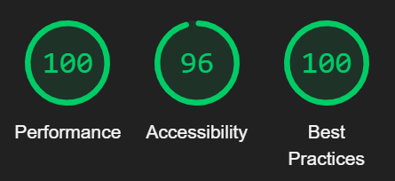

# Batatabit
Proyecto realizar a través de Curso de Responsive Design: Maquetación Mobile First de Platzi.
Se aplicó Mobile First sumado al uso de métricas para validar accesibilidad, performance y buenas prácticas de la página. 

 

[**Prototipo**] en Figma del proyecto(https://www.figma.com/file/sMmlQaZldfDcLERYYWe6h4/Bata-Bit?node-id=44%3A593)

**[Presentación](https://platzi.com/cursos/mobile-first/)** del curso.

**[Certificado](https://platzi.com/p/lucas-napoli/curso/2030-course/diploma/detalle/)** del curso.

**[Demo](https://lucasnapoli7.github.io/batatabit/)** del proyecto.
